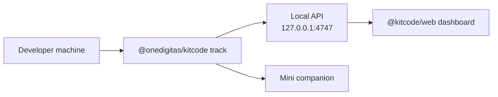

# KitCode

<p align="center">
  
  
  
</p>

<p align="center">
  <strong>A local “have a break” companion for coding campaigns.</strong><br />
  You keep coding. KitCode quietly tracks focus and useful code progress on your machine, then shows when a break reward is ready.
</p>

<p align="center">
  <a href="#for-people">For people</a>
  ·
  <a href="#before-you-set-up">Before you set up</a>
  ·
  <a href="#quick-start">Quick Start</a>
  ·
  <a href="#for-agents--developers">For agents / developers</a>
  ·
  <a href="#privacy">Privacy</a>
</p>

Hosted dashboard: [https://kitcode.vercel.app/](https://kitcode.vercel.app/)

---

## For people

### What is KitCode?

KitCode is a small helper that sits beside your coding work:

1. You (or your coding assistant) turn KitCode on.
2. You pick which project folders to track in the **Welcome** window.
3. KitCode watches local activity and progress — not your private source uploads.
4. The hosted dashboard or Mini companion shows how close you are to a break.

It is opt-in, local-first, and meant to celebrate progress — not to feel like surveillance.

### Before you set up

KitCode setup asks an AI assistant to install software and run commands on your computer. That only works in the right kind of chat.

**Use one of these:**

| Tool | What works | What does not work |
| --- | --- | --- |
| **Codex** | **Codex Task** or **project chat** | Regular chat |
| **Claude** | **Claude Code** (local, can run shell commands) | Cloud-only browser chat (not Claude Code) |

**Minimum requirements before you paste the setup prompt:**

| | **Codex** | **Claude Code** |
| --- | --- | --- |
| App | ChatGPT desktop app | Claude Desktop (Code tab) |
| Permission control | Approve for me or Full access | Auto or Bypass permissions |
| Account plan | Go (or higher) | Pro (or higher) |

For Codex, paste into **Task** or a **project chat**. For Claude, paste into **Claude Code** — not browser chat.

If permission control blocks commands between steps, setup usually fails.

Node.js 20+ is required. Electron is optional, but needed for the native Welcome and Mini windows.

### Quick Start

Easiest path: open the hosted site, copy the **Codex** or **Claude** setup prompt (each copy button pastes an agent-specific prompt), paste it into the matching assistant, then finish **Welcome**.

<p align="center">
  
</p>

Or run it yourself:

<table>
  <tr>
    <th>Command</th>
    <th>What you should see</th>
  </tr>
  <tr>
    <td>
      <pre><code>npx @onedigitas/kitcode codex on
npx @onedigitas/kitcode claude on</code></pre>
    </td>
    <td>
      
      <br />
      Turns on Codex or Claude integration and opens Welcome when setup is not finished yet.
    </td>
  </tr>
  <tr>
    <td>
      <pre><code>Save Welcome with at least one project</code></pre>
    </td>
    <td>
      
      <br />
      Opens the Mini companion and can start background tracking when you chose YES in Welcome.
    </td>
  </tr>
  <tr>
    <td>
      <pre><code>npx @onedigitas/kitcode track
npx @onedigitas/kitcode add .
npx @onedigitas/kitcode dashboard</code></pre>
    </td>
    <td>
      
      <br />
      Starts tracking, adds more projects later, or opens the hosted dashboard.
    </td>
  </tr>
</table>

**Finish Welcome:** confirm project folder(s) — in a Codex or Claude project chat, the current folder is pre-added — choose whether background tracking should start after save, then save. Setup is not complete until Welcome is saved with at least one folder.

### What you can open later

| Window | How to open | What it is |
| --- | --- | --- |
| Mini | Opens after Welcome save | Compact metrics bar beside your work |
| Dashboard | `kitcode dashboard` | Hosted campaign site at kitcode.vercel.app |
| Welcome / setup | `kitcode setup` | Project folders and auto-track preference |

Local tracker address: `http://127.0.0.1:4747`

Mini and Dashboard need the tracker running (`kitcode track`).

### What KitCode counts (plain language)

- **Focus time** — time when your project files were recently active. After about **5 quiet minutes**, new time counts as idle instead.
- **Counted `=`** — new real code lines written **after** you add a project. Code that already existed when you added the folder is only the starting baseline.

Ignored folders include things like `.git`, `node_modules`, `dist`, and `.next`. KitCode compares local snapshots and stores totals — it does not upload your source by default.

### Rewards (plain language)

You earn progress with **both** enough focus time **and** enough counted `=`.

Local break tiers (`10%`, `20%`, `30%`) can be redeemed on your machine. Bigger campaign milestones (`50%`, `100%`) may need a separate campaign login/claim flow when the campaign backs them.

### Privacy

KitCode is local-first. Progress lives under `~/.kitcode/` on your machine.

By default it does **not** send source code, raw diffs, full file paths, project names, or commit metadata. The dashboard reads totals such as active time, counted `=`, and reward progress.

---

## For agents / developers

Use this section as the harness. Prefer the public READMEs and live CLI output over memory.

Package deep-dives:

- [packages/kitcode-cli/README.md](packages/kitcode-cli/README.md) — CLI, tracking, rewards, API, hooks
- [apps/web/README.md](apps/web/README.md) — hosted dashboard only

### Hard setup gates (do not soft-pedal)

Before running installer commands for a human:

1. Confirm the correct app and account plan:
   - **Codex:** ChatGPT desktop app, **Go (or higher)**, permission **Approve for me** or **Full access**
   - **Claude Code:** Claude Desktop (Code tab), **Pro (or higher)**, permission **Auto** or **Bypass permissions**
2. Confirm the session can run setup commands (Codex Task or project chat; Claude Code — not browser chat).
3. Actually execute setup commands. Do not only print instructions for the user to run in another shell session.

### Source of truth

| Owner | Owns |
| --- | --- |
| `@onedigitas/kitcode` CLI | Tracking, reward eligibility, redeem state, hook context, Mini companion |
| Hosted `@kitcode/web` | Progress UI, milestone display, campaign registration UI |
| Campaign backend | Login, consent, valuable reward fulfillment (outside this repo when used) |
| Codex / Claude hooks | Gentle reminders only |

**Do not** calculate or mutate rewards yourself. Use:

```bash
kitcode status
kitcode summary
kitcode awards
```

### Daily commands

| Command | Purpose |
| --- | --- |
| `kitcode add [path]` | Register a project (default: current folder). Existing code becomes baseline. |
| `kitcode remove [path]` | Remove a project and its local contribution data. |
| `kitcode track` | Start the background tracker. |
| `kitcode untrack` | Stop the tracker. Projects stay registered. |
| `kitcode list` | Show added project count. |
| `kitcode status` | Tracker state + compact reward progress. |
| `kitcode summary` | Counted `=`, active time, next milestone. |
| `kitcode awards` | Reward / milestone readiness (`award`, `rewards` aliases). |
| `kitcode setup` | Welcome / preferences. |
| `kitcode dashboard` | Open hosted dashboard for the running tracker. |
| `kitcode uninstall` | Remove hooks, skills, tracker, and `~/.kitcode` data. |
| `kitcode codex on/off/status` | Install, remove, or inspect Codex hook + skill. |
| `kitcode claude on/off/status` | Install, remove, or inspect Claude hook + skill. |

Simplest working flow:

```bash
kitcode track
cd your-project
kitcode add .
kitcode dashboard
```

During first-time `codex on` / `claude on`, do **not** run `add` / `track` for the human. Welcome owns first project selection.

### Git Mode and Vibe Mode

| Mode | When | Tracks |
| --- | --- | --- |
| Git Mode | Folder is inside a Git repo | Commit count, focus time, source-change batches |
| Vibe Mode | Folder is not a Git repo | Focus time and source-change batches |

Both use the same counted-`=` rules. Rewards do not depend on branch, merge, or deploy.

### Default reward targets

- `3600` active seconds (`--reward-seconds` / `KITCODE_REWARD_SECONDS`)
- `30` counted `=` (`--reward-equals` / `KITCODE_REWARD_EQUALS`)

Local redeemable tiers need both time and equals thresholds (`10%` / `20%` / `30%`). `50%` and `100%` are display milestones unless a campaign backend backs them.

### Local state

```txt
~/.kitcode/state.json     Projects, onboarding prefs, reward settings, equals ledger
~/.kitcode/tracker.json   Background tracker PID/host/port metadata
~/.kitcode/hook.log       Hook errors, when logging succeeds
~/.kitcode/bin/kitcode    Durable runner used by agent hooks
```

Disable hooks with `KITCODE_HOOKS_OFF=1`.

### Architecture



### Workspace

```txt
apps/web                 Hosted campaign dashboard (@kitcode/web)
packages/kitcode-cli     Local CLI, tracker, Mini companion, integrations, API (@onedigitas/kitcode)
```

Root scripts:

```bash
npm run dev          # Vite for apps/web on port 8686
npm run build
npm run lint
npm run pack:cli
npm run publish:cli
```

### Publishing (CLI)

Bump version in both:

```txt
packages/kitcode-cli/package.json
packages/kitcode-cli/bin/kitcode.mjs   # VERSION constant
```

Then:

```bash
npm run lint
npm run pack:cli
npm run publish:cli
npm view @onedigitas/kitcode version
npx @onedigitas/kitcode --version
```

---

## Requirements

- Node.js 20+
- Git optional (enables Git Mode)
- Electron optional (required for native Welcome and Mini)
