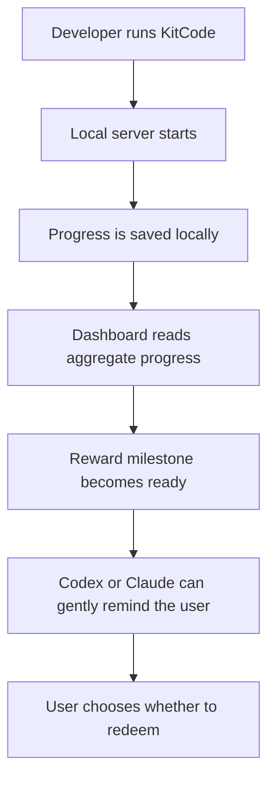
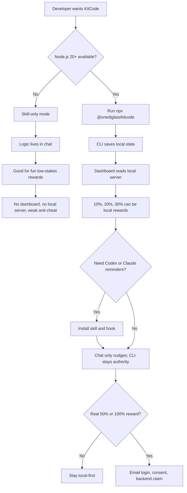

# KitCode

<p align="center">
  
  
  
</p>

<p align="center">
  <strong>A lightweight break companion for developers.</strong><br />
  KitCode tracks focused coding activity locally, shows break progress in a dashboard, and gives soft reminders when it is time to pause.
</p>

<p align="center">
  <a href="#quick-start">Quick Start</a>
  ·
  <a href="#how-it-works">How It Works</a>
  ·
  <a href="#rewards">Rewards</a>
  ·
  <a href="#privacy-and-data">Privacy</a>
  ·
  <a href="#architecture-options">Options</a>
</p>

---

## In Plain English

KitCode is a friendly "have a break" layer for coding campaigns.

It should feel like:

- "You have been focused long enough. Take a break."
- A playful KitKat-style reward moment.
- A local-first progress tracker, not a surveillance tool.
- An opt-in helper for Codex, Claude, hackathons, demos, or internal campaigns.

<table>
  <tr>
    <td><strong>Local-first</strong><br />Progress starts on the developer's machine.</td>
    <td><strong>Opt-in</strong><br />No prompt should be blocked or delayed.</td>
    <td><strong>CLI authority</strong><br />The package owns tracking, rewards, and hook output.</td>
  </tr>
</table>

## Quick Start

Run KitCode from a project folder:

```bash
npx @onedigitas/kitcode
```

Open the dashboard:

```txt
https://kitcode.onedigitas.com/
```

Optional AI workflow reminders:

```bash
npx @onedigitas/kitcode codex on
npx @onedigitas/kitcode claude on
```

The local server runs at:

```txt
http://127.0.0.1:4747
```

## How It Works



The important rule:

> The CLI/package is the source of truth. Skills and hooks should not calculate rewards, edit the ledger, or decide voucher eligibility by themselves.

## Rewards

Today, KitCode has three local reward-backed tiers:

| Tier | Code | Status |
| ---: | --- | --- |
| `10%` | `if(tired){return 10;}` | Local reward tier |
| `20%` | `takeBreak(20);` | Local reward tier |
| `30%` | `while(working)break(30);` | Local reward tier |

The dashboard may also show bigger milestones:

| Milestone | Code | Status |
| ---: | --- | --- |
| `50%` | `mediumStake.unlock(50);` | Display-only today |
| `100%` | `finalBreak.claim(100);` | Display-only today |

For real campaign rewards at `50%` or `100%`, use a backend claim flow with login, consent, and server-side reward records.

## Privacy And Data

<table>
  <tr>
    <th>Before claim</th>
    <th>When claiming valuable rewards</th>
  </tr>
  <tr>
    <td>
      Data stays local in <code>~/.kitcode/state.json</code>.<br /><br />
      This includes aggregate progress such as active time, folder count, commit count, change batches, and total <code>=</code> count.
    </td>
    <td>
      The dashboard should ask the user to log in, show what will be shared, and collect consent.<br /><br />
      Recommended identity: Supabase email auth, magic link, OTP, or another verified login.
    </td>
  </tr>
</table>

KitCode should not send source code, raw diffs, arbitrary file contents, full repo paths, project names, or the full local state file by default.

If a user deletes a local session, they are only logged out locally. When they log in again with the same verified email, the campaign server can restore their existing claim status. If there is no server-side identity, the server cannot reliably know whether a new claim came from the same person.

## Architecture Options



<table>
  <tr>
    <th>Option</th>
    <th>Best for</th>
    <th>Tradeoff</th>
  </tr>
  <tr>
    <td><strong>Skill-only logic</strong></td>
    <td>New users with no Node.js, fun demos, tiny rewards.</td>
    <td>Fastest setup, but easy to cheat and no dashboard/server authority.</td>
  </tr>
  <tr>
    <td><strong>CLI authority</strong></td>
    <td>Most real usage, local dashboard, Codex/Claude reminders.</td>
    <td>Requires Node.js 20+ and the local server.</td>
  </tr>
  <tr>
    <td><strong>Hybrid campaign model</strong></td>
    <td>Valuable <code>50%</code> or <code>100%</code> rewards.</td>
    <td>CLI tracks locally; campaign server handles login, consent, claims, and fulfillment.</td>
  </tr>
</table>

Recommended model: use the CLI for real tracking, let skills only nudge, and use a campaign backend only when rewards become valuable.

## Requirements

- Node.js 20+
- Git for Git Mode

<details>
<summary><strong>Commands</strong></summary>

```bash
kitcode serve
kitcode serve --port 4757
kitcode serve --reward-seconds 3600
kitcode serve --reward-equals 30

kitcode add .
kitcode list
kitcode remove .

kitcode break
kitcode reward
kitcode redeem
kitcode redeem --tier 10

kitcode codex on
kitcode codex status
kitcode codex off
kitcode claude on
kitcode claude status
kitcode claude off

kitcode stop
kitcode start
```

</details>

<details>
<summary><strong>API And Developer Notes</strong></summary>

```txt
GET  /api/health
GET  /api/summary
GET  /api/projects
GET  /api/events
POST /api/reward/redeem
```

Project-level mutation and commit-detail endpoints return `410 Gone`.

Workspace:

```txt
apps/web                 Web dashboard
packages/kitcode-cli     Local CLI, server, integrations, and API
```

Root scripts:

```bash
npm run dev
npm run build
npm run lint
npm run pack:cli
npm run publish:cli
```

To allow another hosted dashboard origin:

```bash
KITCODE_ALLOWED_ORIGINS=https://your-kitcode-web.example npx @onedigitas/kitcode serve
```

</details>

<details>
<summary><strong>Publishing</strong></summary>

Update the CLI version in both places before publishing:

```txt
packages/kitcode-cli/package.json
packages/kitcode-cli/bin/kitcode.mjs
```

Example patch release:

```bash
npm version patch -w @onedigitas/kitcode --no-git-tag-version
```

Then update the `VERSION` constant in `packages/kitcode-cli/bin/kitcode.mjs` to the same value.

Verify and publish:

```bash
npm run lint
npm run pack:cli
npm run publish:cli
```

After publish, confirm the registry version:

```bash
npm view @onedigitas/kitcode version
npx @onedigitas/kitcode --version
```

</details>
