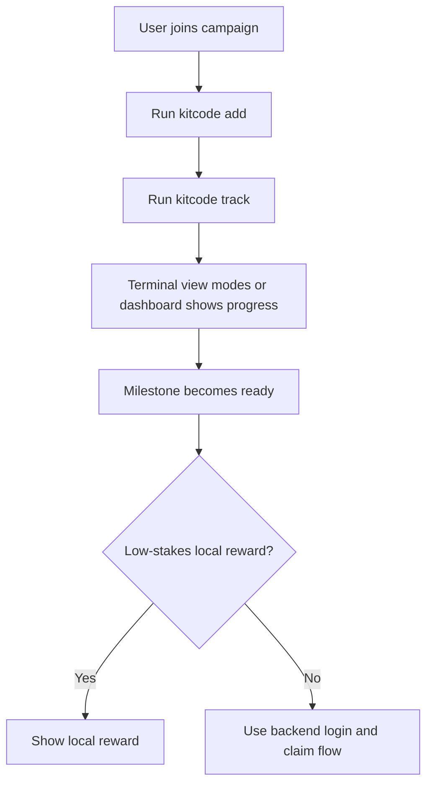

# KitCode

<p align="center">
  
  
  
</p>

<p align="center">
  <strong>A local break companion for coding campaigns.</strong><br />
  KitCode tracks focused coding activity, shows progress in a safe terminal with switchable view modes or dashboard, and helps turn good work into a playful break moment.
</p>

<p align="center">
  <a href="#quick-start">Quick Start</a>
  ·
  <a href="#what-kitcode-counts">What It Counts</a>
  ·
  <a href="#git-mode-and-vibe-mode">Modes</a>
  ·
  <a href="#privacy">Privacy</a>
</p>

---

## What Is KitCode?

KitCode is a small local tracker for coding campaigns. Think of it as a friendly "have a break" layer that sits beside your work:

- Developers keep coding normally.
- KitCode watches local activity and progress.
- A safe terminal with compact progress views or a dashboard shows how close the user is to a break reward.
- Codex or Claude can gently remind the user when a milestone is ready.

It is designed to feel light, opt-in, and campaign-friendly. It should help people celebrate progress, not make them feel watched.

## Quick Start

Use the command on the left, then look for the screen on the right.

<table>
  <tr>
    <th>Command</th>
    <th>What it opens or enables</th>
  </tr>
  <tr>
    <td>
      <pre><code>npx @onedigitas/kitcode codex on
npx @onedigitas/kitcode claude on</code></pre>
    </td>
    <td>
      <!-- TODO: Replace with final welcome screen image if needed -->
      
      <br />
      Welcome screen: introduces the campaign and helps the user get started.
    </td>
  </tr>
  <tr>
    <td>
      <pre><code>npx @onedigitas/kitcode add .
npx @onedigitas/kitcode track
npx @onedigitas/kitcode terminal</code></pre>
    </td>
    <td>
      <!-- TODO: Replace with final terminal view mode image if needed -->
      
      <br />
      Terminal: a safe command surface with compact, progress, and watch view modes plus an opt-in PET toggle.
    </td>
  </tr>
  <tr>
    <td>
      <pre><code>npx @onedigitas/kitcode dashboard</code></pre>
    </td>
    <td>
      <!-- TODO: Replace with final dashboard image if needed -->
      
      <br />
      Dashboard: shows progress, milestones, and reward status.
    </td>
  </tr>
</table>

The local tracker serves data at:

```txt
http://127.0.0.1:4747
```

## Daily Use

| Command | What it does |
| --- | --- |
| `kitcode add .` | Add the current project to KitCode. Existing code becomes the baseline. |
| `kitcode track` | Start the background tracker. It can run before or after projects are added. |
| `kitcode terminal` | Open the safe KitCode terminal window, switchable progress views, and the session-only PET toggle. |
| `kitcode dashboard` | Open the full dashboard. |
| `kitcode list` | Show how many projects are added. |
| `kitcode untrack` | Stop the background tracker. Added projects stay registered. |
| `kitcode remove .` | Remove the current project and its local contribution data. |

The simplest working flow is:

```bash
kitcode track
cd your-project
kitcode add .
kitcode terminal
```

Inside KitCode Terminal, use the `PET OFF` / `PET ON` control in the window chrome to hide or show the desktop companion. The pet is off by default, closes with the Terminal window, and does not add a separate CLI or safe-shell command.

You can also add first and start tracking later:

```bash
cd your-project
kitcode add .
kitcode track
```

## What KitCode Counts

KitCode tracks two simple ideas: focused time and useful code movement.

**Focus time** means the project had recent activity. If the project has been quiet for a while, time moves into idle time instead of active time.

**Equal count** means KitCode found new code lines with `=` after the project was added. Code that already exists when you run `kitcode add .` is only the baseline. It does not earn reward by itself.

Example:

```js
const total = price + tax
```

That new line contains one `=`, so it can add one counted equal. If the same line was already there before `kitcode add .`, it is part of the baseline and does not count.

KitCode uses source snapshots, not raw source uploads. It compares local file snapshots to find new code lines, then stores aggregate progress.

## Git Mode And Vibe Mode

KitCode supports two project modes automatically.

| Mode | When it happens | What KitCode tracks |
| --- | --- | --- |
| Git Mode | The folder is inside a Git repository. | Commit count, focus time, and source-change batches. |
| Vibe Mode | The folder is not inside a Git repository. | Focus time and source-change batches. |

Both modes use the same `=` counting logic:

- `kitcode add .` creates the baseline.
- New code lines after that baseline can add counted `=`.
- Existing code does not count just because it exists.
- Git commits are still shown as useful project telemetry, but rewards do not depend on a specific branch, merge, or deploy flow.

This keeps KitCode friendly to normal work styles:

```txt
feature branch -> dev -> staging -> production
```

The developer can keep working on a feature branch. KitCode can still track local progress without waiting for staging or production.

## Rewards

KitCode has playful local reward tiers:

| Tier | Code | Status |
| ---: | --- | --- |
| `10%` | `if(tired){return 10;}` | Local reward tier |
| `20%` | `takeBreak(20);` | Local reward tier |
| `30%` | `while(working)break(30);` | Local reward tier |

The dashboard may also show bigger campaign milestones:

| Milestone | Code | Status |
| ---: | --- | --- |
| `50%` | `mediumStake.unlock(50);` | Display-only unless backed by campaign flow |
| `100%` | `finalBreak.claim(100);` | Display-only unless backed by campaign flow |

For valuable rewards, use a backend claim flow with login, consent, and server-side records. The local tracker is great for progress and low-stakes rewards; campaign fulfillment should be handled by the campaign backend.

## Privacy

KitCode is local-first.

Local progress lives here:

```txt
~/.kitcode/state.json
```

By default, KitCode does not send:

- source code
- raw diffs
- arbitrary file contents
- full local paths
- project names
- commit metadata

The local dashboard/API reads aggregate values such as:

- active and idle time
- added project count
- commit count
- change batch count
- total counted `=`
- reward progress

## Campaign Model

KitCode works best as a local companion plus optional campaign backend:



Recommended split:

| Layer | Owns |
| --- | --- |
| KitCode CLI | local tracking, local reward state, hook context |
| Dashboard | progress display, milestone display, claim UI |
| Campaign backend | login, consent, valuable reward claims, fulfillment |
| Codex/Claude hooks | gentle reminders only |

## Requirements

- Node.js 20+
- Git is optional, but enables Git Mode for repositories

## Commands

```bash
kitcode add .
kitcode list
kitcode track
kitcode untrack
kitcode terminal
kitcode dashboard
kitcode remove .

kitcode codex on
kitcode codex status
kitcode codex off
kitcode claude on
kitcode claude status
kitcode claude off
```

Useful tracker options:

```bash
kitcode track --port 4757
kitcode track --reward-seconds 3600
kitcode track --reward-equals 30
```

To allow another hosted dashboard origin:

```bash
KITCODE_ALLOWED_ORIGINS=https://your-kitcode-web.example npx @onedigitas/kitcode track
```

## Developer Notes

```txt
GET  /api/health
GET  /api/summary
GET  /api/projects
GET  /api/events
POST /api/reward/redeem
```

Project-level mutation and commit-detail endpoints return `410 Gone`.

Workspace:

```txt
apps/web                 Web dashboard
packages/kitcode-cli     Local CLI, tracker, terminal view modes, integrations, and API
```

Root scripts:

```bash
npm run dev
npm run build
npm run lint
npm run pack:cli
npm run publish:cli
```

## Publishing

Update the CLI version in both places before publishing:

```txt
packages/kitcode-cli/package.json
packages/kitcode-cli/bin/kitcode.mjs
```

Example patch release:

```bash
npm version patch -w @onedigitas/kitcode --no-git-tag-version
```

Then update the `VERSION` constant in `packages/kitcode-cli/bin/kitcode.mjs` to the same value.

Verify and publish:

```bash
npm run lint
npm run pack:cli
npm run publish:cli
```

After publish, confirm the registry version:

```bash
npm view @onedigitas/kitcode version
npx @onedigitas/kitcode --version
```
