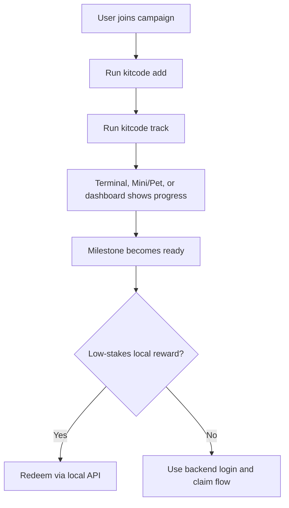
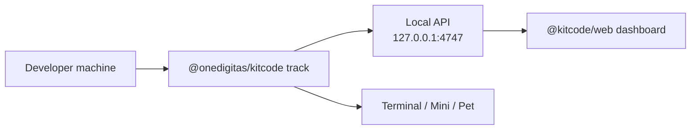

# KitCode

<p align="center">
  
  
  
</p>

<p align="center">
  <strong>A local break companion for coding campaigns.</strong><br />
  KitCode tracks focused coding activity, shows progress in a safe terminal with switchable view modes or hosted dashboard, and helps turn good work into a playful break moment.
</p>

<p align="center">
  <a href="#quick-start">Quick Start</a>
  ·
  <a href="#what-kitcode-counts">What It Counts</a>
  ·
  <a href="#git-mode-and-vibe-mode">Modes</a>
  ·
  <a href="#rewards">Rewards</a>
  ·
  <a href="#privacy">Privacy</a>
  ·
  <a href="#developer-notes">Developer Notes</a>
</p>

---

## What Is KitCode?

KitCode is a small local tracker for coding campaigns. Think of it as a friendly "have a break" layer that sits beside your work:

- Developers keep coding normally.
- KitCode watches local activity and progress.
- A safe terminal with compact, progress, and watch views — or a hosted dashboard — shows how close the user is to a break reward.
- Codex or Claude can gently remind the user when a milestone is ready.

It is designed to feel light, opt-in, and campaign-friendly. It should help people celebrate progress, not make them feel watched.

Hosted dashboard: [https://kitcode.onedigitas.com/](https://kitcode.onedigitas.com/)

## Quick Start

Use the command on the left, then look for the screen on the right.

<table>
  <tr>
    <th>Command</th>
    <th>What it opens or enables</th>
  </tr>
  <tr>
    <td>
      <pre><code>npx @onedigitas/kitcode codex on
npx @onedigitas/kitcode claude on</code></pre>
    </td>
    <td>
      
      <br />
      Codex / Claude integration plus optional Welcome setup when onboarding is not complete.
    </td>
  </tr>
  <tr>
    <td>
      <pre><code>npx @onedigitas/kitcode add .
npx @onedigitas/kitcode track
npx @onedigitas/kitcode terminal</code></pre>
    </td>
    <td>
      
      <br />
      Terminal: a safe command surface with compact, progress, and watch view modes plus an opt-in PET toggle.
    </td>
  </tr>
  <tr>
    <td>
      <pre><code>npx @onedigitas/kitcode dashboard</code></pre>
    </td>
    <td>
      
      <br />
      Hosted dashboard: progress, milestones, and reward status from the local tracker.
    </td>
  </tr>
</table>

The local tracker serves data at:

```txt
http://127.0.0.1:4747
```

`kitcode dashboard` opens the hosted campaign site, which reads from that local API.

## Daily Use

| Command | What it does |
| --- | --- |
| `kitcode add [path]` | Add a project. Defaults to the current folder. Existing code becomes the baseline. |
| `kitcode remove [path]` | Remove a project and its local contribution data. |
| `kitcode track` | Start the background tracker. It can run before or after projects are added. |
| `kitcode untrack` | Stop the background tracker. Added projects stay registered. |
| `kitcode list` | Show how many projects are added. |
| `kitcode status` | Show tracker state, project count, and compact reward progress. |
| `kitcode summary` | Show total counted `=`, active time, and next milestone progress. |
| `kitcode awards` | Show reward and milestone readiness. Aliases: `award`, `rewards`. |
| `kitcode terminal` | Open the safe KitCode terminal window and switchable progress views. |
| `kitcode terminal --pet` | Open terminal and the companion pet together. |
| `kitcode pet` | Open the independent desktop companion, defaulting to Pet view. |
| `kitcode setup` | Open KitCode Welcome: projects, auto-track, Mini or Pet preference. |
| `kitcode dashboard` | Open the hosted dashboard for the running tracker. |
| `kitcode codex on/off/status` | Install, remove, or inspect the Codex hook and skill. |
| `kitcode claude on/off/status` | Install, remove, or inspect the Claude hook and skill. |

The simplest working flow is:

```bash
kitcode track
cd your-project
kitcode add .
kitcode terminal
```

`terminal`, `pet`, and `dashboard` require a running tracker.

The Mini bar and Pet mascot live in the same companion host. Use `kitcode setup` to choose the default companion and tracking preference. There is no standalone `kitcode mini` command.

You can also add first and start tracking later:

```bash
cd your-project
kitcode add .
kitcode track
```

## Surfaces

| Surface | How to open | What it shows |
| --- | --- | --- |
| Terminal | `kitcode terminal` | Safe command surface with compact, progress, and watch views |
| Mini | `kitcode setup` or companion switcher | Compact metrics bar at `/companion` |
| Pet | `kitcode pet` or `kitcode terminal --pet` | Animated mascot at `/pet` |
| Dashboard | `kitcode dashboard` | Hosted campaign UI at kitcode.onedigitas.com |
| Welcome | `kitcode setup` | Project folders, auto-track, companion preference |

Electron is optional but required for native Terminal, Mini, Pet, and Welcome windows.

## What KitCode Counts

KitCode tracks two simple ideas: focused time and useful code movement.

**Focus time** means the project had recent filesystem activity. If a project is quiet for **5 minutes**, new time is recorded as idle time instead of active time.

**Equal count** means KitCode found new `=` characters on real code lines added after the project baseline. Code that already exists when you run `kitcode add .` is only the baseline. It does not earn reward by itself.

Example:

```js
const total = price + tax
```

If that line is new after `kitcode add .` and passes the real-code-line check, its `=` characters count toward the ledger.

KitCode uses source snapshots, not raw source uploads. It compares local file snapshots to find new code lines, then stores aggregate progress.

Ignored paths include `.git`, `node_modules`, `dist`, `build`, `.next`, `out`, and `coverage`. Files larger than 1 MB and binary files are skipped.

## Git Mode And Vibe Mode

KitCode supports two project modes automatically.

| Mode | When it happens | What KitCode tracks |
| --- | --- | --- |
| Git Mode | The folder is inside a Git repository. | Commit count, focus time, and source-change batches. |
| Vibe Mode | The folder is not inside a Git repository. | Focus time and source-change batches. |

Both modes use the same `=` counting logic:

- `kitcode add .` creates the baseline.
- New code lines after that baseline can add counted `=`.
- Existing code does not count just because it exists.
- Git commits are still shown as useful project telemetry, but rewards do not depend on a specific branch, merge, or deploy flow.

This keeps KitCode friendly to normal work styles:

```txt
feature branch -> dev -> staging -> production
```

The developer can keep working on a feature branch. KitCode can still track local progress without waiting for staging or production.

## Rewards

Default campaign targets:

- `3600` active seconds (`--reward-seconds`)
- `30` counted `=` (`--reward-equals`)

Each milestone needs both enough active time and enough counted `=`:

- time target for a percent = `ceil(requiredSeconds * percent / 100)`
- equals target comes from the tier table below

### Local reward tiers

| Tier | Code | Required counted `=` | Status |
| ---: | --- | ---: | --- |
| `10%` | `if(tired){return 10;}` | 3 | Local reward tier |
| `20%` | `takeBreak(20);` | 6 | Local reward tier |
| `30%` | `while(working)break(30);` | 9 | Local reward tier |

### Campaign milestones

| Milestone | Code | Required counted `=` | Status |
| ---: | --- | ---: | --- |
| `50%` | `mediumStake.unlock(50);` | 12 | Display-only unless backed by campaign flow |
| `100%` | `finalBreak.claim(100);` | 15 | Display-only unless backed by campaign flow |

For valuable rewards, use a backend claim flow with login, consent, and server-side records. The local tracker is great for progress and low-stakes rewards; campaign fulfillment should be handled by the campaign backend.

## Privacy

KitCode is local-first.

Local progress lives here:

```txt
~/.kitcode/state.json     Projects, onboarding prefs, reward settings, equals ledger
~/.kitcode/tracker.json   Background tracker PID/host/port metadata
~/.kitcode/hook.log       Hook errors, when logging succeeds
~/.kitcode/bin/kitcode    Durable runner used by agent hooks
```

By default, KitCode does not send:

- source code
- raw diffs
- arbitrary file contents
- full local paths
- project names
- commit metadata

The local API and hosted dashboard read aggregate values such as:

- active and idle time
- added project count
- commit count
- change batch count
- total counted `=`
- reward progress and tier state

## Campaign Model

KitCode works best as a local companion plus optional campaign backend:



Recommended split:

| Layer | Owns |
| --- | --- |
| KitCode CLI | local tracking, local reward state, hook context, terminal/companion surfaces |
| Hosted dashboard | progress display, milestone display, campaign registration UI |
| Campaign backend | login, consent, valuable reward claims, fulfillment |
| Codex/Claude hooks | gentle reminders only |

`kitcode codex on` and `kitcode claude on` install a KitCode skill plus a `UserPromptSubmit` hook. After each submitted prompt, the hook fails open and can add compact local context: total counted `=`, active time, next milestone progress, and reward readiness. Agents should use `kitcode summary`, `kitcode awards`, and `kitcode status` instead of calculating reward state themselves.

Disable hooks with `KITCODE_HOOKS_OFF=1`.

## Requirements

- Node.js 20+
- Git is optional, but enables Git Mode for repositories
- Electron is optional, but required for native Terminal, Mini, Pet, and Welcome windows

## Commands

```bash
kitcode add .
kitcode remove .
kitcode list
kitcode track
kitcode untrack
kitcode status
kitcode summary
kitcode awards
kitcode terminal
kitcode terminal --pet
kitcode pet
kitcode setup
kitcode dashboard

kitcode codex on
kitcode codex status
kitcode codex off
kitcode claude on
kitcode claude status
kitcode claude off
```

Useful tracker options:

```bash
kitcode track --port 4757
kitcode track --reward-seconds 3600
kitcode track --reward-equals 30
kitcode dashboard --no-open
```

Environment variables:

| Variable | Effect |
| --- | --- |
| `KITCODE_REWARD_SECONDS` | Override default reward time target |
| `KITCODE_REWARD_EQUALS` | Override default reward equals target |
| `KITCODE_ALLOWED_ORIGINS` | Comma-separated extra CORS origins for the local API |
| `KITCODE_NO_OPEN` | Skip auto-opening the hosted dashboard |
| `KITCODE_HOOKS_OFF` | Disable prompt hook side effects |

To allow another hosted dashboard origin:

```bash
KITCODE_ALLOWED_ORIGINS=https://your-kitcode-web.example npx @onedigitas/kitcode track
```

Default allowed origins already include `https://kitcode.onedigitas.com` and local dev hosts on ports `3000`, `5173`, and `8686`.

## Developer Notes

### Architecture



### Local API

```txt
GET  /api/health
GET  /api/summary
GET  /api/projects
GET  /api/events
GET  /terminal
GET  /pet
GET  /companion
GET  /pet-assets/kit-terminal/spritesheet.webp
GET  /pet-assets/kit-terminal/pet.json
POST /api/reward/redeem
```

`/api/events` is a Server-Sent Events stream that emits `summary` every second.

`POST /api/reward/redeem` accepts an optional JSON body `{ "tier": 10 }`. If `tier` is omitted, all ready local tiers are redeemed.

Project-level mutation and commit-detail endpoints return `410 Gone`.

### Workspace

```txt
apps/web                 Hosted campaign dashboard (@kitcode/web)
packages/kitcode-cli     Local CLI, tracker, terminal, integrations, and API (@onedigitas/kitcode)
```

Package READMEs:

- [apps/web/README.md](apps/web/README.md)
- [packages/kitcode-cli/README.md](packages/kitcode-cli/README.md)

Root scripts:

```bash
npm run dev          # Vite dev server for apps/web on port 8686
npm run build
npm run lint
npm run pack:cli
npm run publish:cli
```

## Publishing

Update the CLI version in both places before publishing:

```txt
packages/kitcode-cli/package.json
packages/kitcode-cli/bin/kitcode.mjs
```

Example patch release:

```bash
npm version patch -w @onedigitas/kitcode --no-git-tag-version
```

Then update the `VERSION` constant in `packages/kitcode-cli/bin/kitcode.mjs` to the same value.

Verify and publish:

```bash
npm run lint
npm run pack:cli
npm run publish:cli
```

After publish, confirm the registry version:

```bash
npm view @onedigitas/kitcode version
npx @onedigitas/kitcode --version
```
