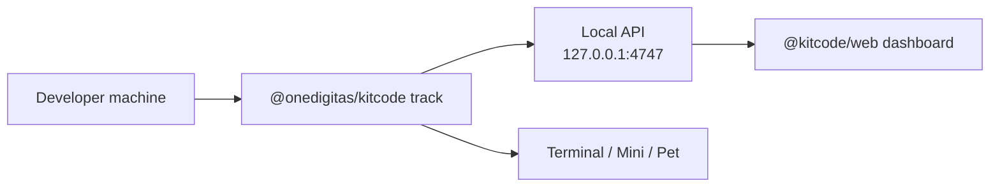

# @kitcode/web

Hosted campaign dashboard for KitCode. The app reads aggregate progress from the local CLI tracker and presents break milestones, reward tiers, and campaign registration flows.

Production: [https://kitcode.onedigitas.com/](https://kitcode.onedigitas.com/)

## How It Fits Together



| Layer | Responsibility |
| --- | --- |
| `@onedigitas/kitcode` | Local tracking, reward eligibility, claim state, terminal/companion surfaces |
| `@kitcode/web` | Progress display, milestone UI, campaign registration, admin preview |
| Campaign backend | Login, consent, valuable reward fulfillment (not implemented in this app) |

The dashboard never receives source code. It only reads aggregate values from the local KitCode server.

## Prerequisites

1. Node.js 20+
2. A running local tracker:

```bash
npx @onedigitas/kitcode track
```

3. At least one added project:

```bash
npx @onedigitas/kitcode add .
```

Without a running tracker and at least one added project, the app shows the **Project Gateway** onboarding screen instead of the dashboard.

## Local Development

From the repository root:

```bash
npm run dev
```

Or from this workspace:

```bash
npm run dev -w @kitcode/web
```

Dev server: [http://127.0.0.1:8686](http://127.0.0.1:8686)

The CLI allows these origins by default:

- `http://127.0.0.1:8686`
- `http://localhost:8686`
- `https://kitcode.onedigitas.com`

To allow another hosted origin:

```bash
KITCODE_ALLOWED_ORIGINS=https://your-kitcode-web.example npx @onedigitas/kitcode track
```

## App Views

### Project Gateway

Shown when:

- the local tracker is not reachable, or
- no projects are added yet

Provides:

- connection status and setup guidance
- copyable Codex / Claude setup prompts
- campaign intro prompt for LLM assistants
- links to the public README and campaign landing page

### Activity Dashboard

Shown when the local tracker is connected and at least one project is added.

Displays:

- global metrics: active time, idle time, commits, change batches, counted `=`
- break progress timeline across 10%, 20%, 30%, 50%, and 100% milestones
- local reward tiers (10%, 20%, 30%) with redeem support
- campaign milestones (50%, 100%) with registration / gift-selection UI

### Admin Page

Preview-only campaign analytics with dummy data. It is not wired to a backend.

### Geo Block View

Static campaign geo-block preview screen.

## Reward Model In The UI

Reward logic comes from the CLI. The dashboard renders it; it does not calculate eligibility itself.

| Milestone | Code | Backed by CLI redeem | UI behavior |
| ---: | --- | --- | --- |
| `10%` | `if(tired){return 10;}` | Yes | Local redeem via API |
| `20%` | `takeBreak(20);` | Yes | Local redeem via API |
| `30%` | `while(working)break(30);` | Yes | Local redeem via API |
| `50%` | `mediumStake.unlock(50);` | Display-only | Opens developer registration form |
| `100%` | `finalBreak.claim(100);` | Display-only | Opens legendary gift picker after registration |

Each milestone requires both:

- enough tracked active time for that percent of the campaign target, and
- enough counted `=` characters

Default campaign targets (configurable on the CLI):

- `3600` active seconds
- `30` counted `=`

Tier equals thresholds from the CLI contract:

| Percent | Required counted `=` |
| ---: | ---: |
| 10% | 3 |
| 20% | 6 |
| 30% | 9 |
| 50% | 12 |
| 100% | 15 |

Engagement completion in the UI is based on the `30%` tier becoming unlocked.

## Developer Registration

For `50%` and `100%` campaign flows, the app stores a developer profile in `sessionStorage` under `kitcode:developer-profile`.

Stored fields:

- name
- email
- team
- optional notes
- share-data consent
- avatar initials
- registration timestamp

This is browser-session data only. It is not sent to the local KitCode API by default.

## Local API Consumed

Base URL: `http://127.0.0.1:4747`

| Endpoint | Method | Used for |
| --- | --- | --- |
| `/api/health` | GET | Tracker identity check |
| `/api/summary` | GET | Dashboard metrics and reward state |
| `/api/reward/redeem` | POST | Redeem ready local tiers |

The hook polls health and summary every second via `useKitCodeServer`.

`fetch` uses a local-network fallback (`targetAddressSpace: 'local'`) when the browser blocks private-network access on the first attempt.

## Scripts

```bash
npm run dev       # Vite dev server on port 8686
npm run build     # Production build
npm run preview   # Preview production build
npm run lint      # Rule checks + TypeScript
```

## Project Structure

```txt
apps/web/
  src/
    app.tsx                     Main view routing
    components/
      project-gateway.tsx       Setup / onboarding screen
      activity-dashboard.tsx    Break progress and rewards
      registration-form.tsx     Medium-stake registration
      admin-page.tsx            Dummy campaign analytics
      geo-block-view.tsx        Geo-block preview
    hooks/
      use-kitcode-server.ts     Poll local tracker
    lib/
      kitcode-api.ts            Local API client
      reward-progress.ts        Milestone display helpers
      developer-profile.ts      Session registration state
```

## Privacy

The web app:

- reads only aggregate tracker data from `127.0.0.1:4747`
- does not upload source code, diffs, repo paths, or commit metadata
- keeps developer registration in browser `sessionStorage` for campaign UI only

For full local-state details, see [packages/kitcode-cli/README.md](../../packages/kitcode-cli/README.md).
