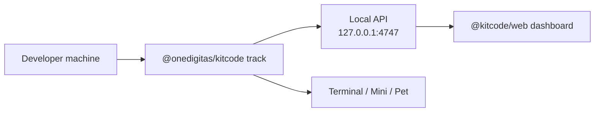
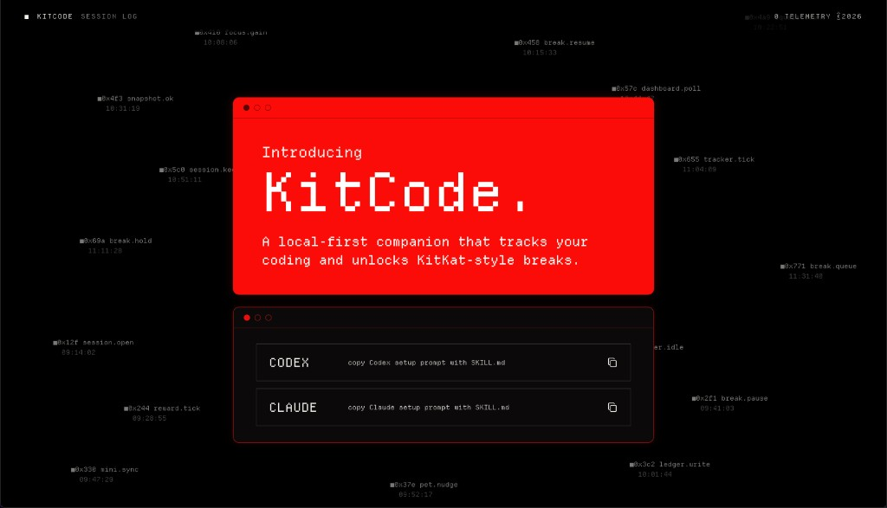

# @kitcode/web

Hosted campaign dashboard for KitCode. This app reads aggregate progress from the local CLI tracker and shows break milestones, reward tiers, and campaign registration UI.

Production: [https://kitcode.vercel.app/](https://kitcode.vercel.app/)  
Product + agent setup harness: [root README](../../README.md)  
CLI source of truth: [packages/kitcode-cli/README.md](../../packages/kitcode-cli/README.md)

---

## For people

### What this app does

When KitCode is tracking on your machine, this dashboard shows:

- how much focus time and counted `=` you have
- break progress toward local rewards
- campaign milestone / registration screens when the campaign uses them

It does **not** upload your source code. It only reads totals from your local KitCode tracker.

### Before you set up from the gateway

If the site asks you to paste a Codex or Claude setup prompt:

| Tool | Use this | Do not use |
| --- | --- | --- |
| **Codex** | **Codex Task** or **project chat** (Desktop, Go+) | Regular chat |
| **Claude** | **Claude Code** on Claude Desktop (Pro+) | Cloud-only browser chat |

**Minimum requirements:**

| | **Codex** | **Claude Code** |
| --- | --- | --- |
| App | ChatGPT desktop app | Claude Desktop (Code tab) |
| Permission control | Approve for me or Full access | Auto or Bypass permissions |
| Account plan | Go (or higher) | Pro (or higher) |

Full setup guidance lives in the [root README](../../README.md).

### Prerequisites

1. Node.js 20+
2. A running local tracker:

```bash
npx @onedigitas/kitcode track
```

3. At least one added project (Welcome or `kitcode add .`)

Without a reachable tracker and at least one project, the app shows the **Project Gateway** instead of the dashboard.

---

## For agents / developers

### How it fits together



| Layer | Responsibility |
| --- | --- |
| `@onedigitas/kitcode` | Local tracking, reward eligibility, claim state, terminal/companion surfaces |
| `@kitcode/web` | Progress display, milestone UI, campaign registration, admin preview |
| Campaign backend | Login, consent, valuable reward fulfillment (not implemented in this app) |

This package must **not** invent reward math. It renders CLI summary / redeem APIs.

For install gates (app, permission control, account plan), follow the [root README](../../README.md). Do not soften those rules in agent replies.

## Local development

From the repository root:

```bash
npm run dev
```

Or:

```bash
npm run dev -w @kitcode/web
```

Dev server: [http://127.0.0.1:8686](http://127.0.0.1:8686)

Default CLI-allowed origins:

- `http://127.0.0.1:8686`
- `http://localhost:8686`
- `https://kitcode.vercel.app`

Extra origin example:

```bash
KITCODE_ALLOWED_ORIGINS=https://your-kitcode-web.example npx @onedigitas/kitcode track
```

## App views

### Project Gateway

Shown when the local tracker is unreachable or no projects are added yet.

<p align="center">
  
</p>

Provides:

- connection status and setup guidance
- copyable Codex / Claude setup prompts
- links to the public README and campaign landing page

### Activity Dashboard

Shown when the tracker is connected and at least one project is added.

<p align="center">
  
</p>

Displays:

- global metrics: active time, idle time, commits, change batches, counted `=`
- break progress across 10%, 20%, 30%, 50%, and 100%
- local reward tiers (10%, 20%, 30%) with redeem support
- campaign milestones (50%, 100%) with registration / gift-selection UI

### Admin Page

Preview-only campaign analytics with dummy data. Not wired to a backend.

### Geo Block View

Static campaign geo-block preview screen.

## Reward model in the UI

Reward logic comes from the CLI. The dashboard renders it.

| Milestone | Code | Backed by CLI redeem | UI behavior |
| ---: | --- | --- | --- |
| `10%` | `if(tired){return 10;}` | Yes | Local redeem via API |
| `20%` | `takeBreak(20);` | Yes | Local redeem via API |
| `30%` | `while(working)break(30);` | Yes | Local redeem via API |
| `50%` | `mediumStake.unlock(50);` | Display-only | Opens developer registration form |
| `100%` | `finalBreak.claim(100);` | Display-only | Opens legendary gift picker after registration |

Each milestone needs both enough active time for that percent and enough counted `=`.

Default CLI targets:

- `3600` active seconds
- `30` counted `=`

| Percent | Required counted `=` |
| ---: | ---: |
| 10% | 3 |
| 20% | 6 |
| 30% | 9 |
| 50% | 12 |
| 100% | 15 |

Engagement completion in the UI is based on the `30%` tier becoming unlocked.

## Developer registration

For `50%` and `100%` campaign flows, the app stores a developer profile in `sessionStorage` under `kitcode:developer-profile`.

Stored fields: name, email, team, optional notes, share-data consent, avatar initials, registration timestamp.

Browser-session data only. Not sent to the local KitCode API by default.

## Local API consumed

Base URL: `http://127.0.0.1:4747`

| Endpoint | Method | Used for |
| --- | --- | --- |
| `/api/health` | GET | Tracker identity check |
| `/api/summary` | GET | Dashboard metrics and reward state |
| `/api/reward/redeem` | POST | Redeem ready local tiers |

`useKitCodeServer` polls health and summary every second.

`fetch` marks KitCode requests as loopback (`targetAddressSpace: 'loopback'`) so Chrome can reach `127.0.0.1:4747` from the hosted dashboard origin.

## Scripts

```bash
npm run dev       # Vite on port 8686
npm run build     # Production build
npm run preview   # Preview production build
npm run lint      # Rule checks + TypeScript
```

## Project structure

```txt
apps/web/
  src/
    app.tsx                     Main view routing
    components/
      project-gateway.tsx       Setup / onboarding screen
      activity-dashboard.tsx    Break progress and rewards
      registration-form.tsx     Medium-stake registration
      admin-page.tsx            Dummy campaign analytics
      geo-block-view.tsx        Geo-block preview
    hooks/
      use-kitcode-server.ts     Poll local tracker
    lib/
      kitcode-api.ts            Local API client
      reward-progress.ts        Milestone display helpers
      developer-profile.ts      Session registration state
```

## Privacy

The web app:

- reads only aggregate tracker data from `127.0.0.1:4747`
- does not upload source code, diffs, repo paths, or commit metadata
- keeps developer registration in browser `sessionStorage` for campaign UI only

For full local-state details, see [packages/kitcode-cli/README.md](../../packages/kitcode-cli/README.md).
