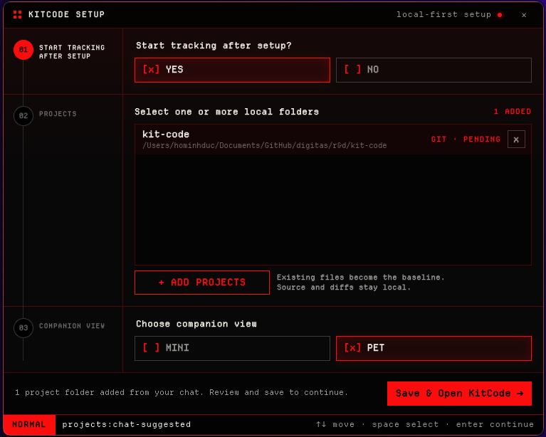

# @onedigitas/kitcode

Local break companion for coding campaigns. This package is the **source of truth** for tracking, reward eligibility, redeem state, hooks, and local Terminal / Mini / Pet surfaces.

Published package: `@onedigitas/kitcode`  
Hosted dashboard: [https://kitcode.onedigitas.com/](https://kitcode.onedigitas.com/)  
Product overview: [root README](../../README.md)

---

## For people

### Before you set up

Setup only works when an assistant can run commands on your machine.

| Tool | What works | What does not work |
| --- | --- | --- |
| **Codex** | Local Codex with **terminal / shell**. **Task** is OK. | Regular chat without terminal |
| **Claude** | **Claude Code** | Cloud-only Claude chat |

**Turn Ask for approval fully off** before pasting any setup prompt. If approval stays on, install/setup usually fails.

### Quick Start

<table>
  <tr>
    <th>Command</th>
    <th>What it opens or enables</th>
  </tr>
  <tr>
    <td>
      <pre><code>npx @onedigitas/kitcode codex on
npx @onedigitas/kitcode claude on</code></pre>
    </td>
    <td>
      
      <br />
      Codex / Claude integration plus Welcome when onboarding is incomplete.
    </td>
  </tr>
  <tr>
    <td>
      <pre><code>npx @onedigitas/kitcode add .
npx @onedigitas/kitcode track
npx @onedigitas/kitcode terminal</code></pre>
    </td>
    <td>
      
      <br />
      Terminal with compact, progress, and watch views plus optional PET toggle.
    </td>
  </tr>
  <tr>
    <td>
      <pre><code>npx @onedigitas/kitcode dashboard</code></pre>
    </td>
    <td>
      
      <br />
      Hosted dashboard reading from the local tracker.
    </td>
  </tr>
</table>

Local API: `http://127.0.0.1:4747`

Finish **Welcome** with at least one project folder before expecting tracking to work.

---

## For agents / developers

### Hard rules

1. Use a terminal-capable session only (Codex with shell / Task, or Claude Code).
2. Require **Ask for approval** to be off before running install/setup.
3. Execute commands yourself. Do not stop after printing shell instructions.
4. Never calculate or mutate rewards. Use `kitcode status`, `kitcode summary`, and `kitcode awards`.

### Daily commands

| Command | What it does |
| --- | --- |
| `kitcode add [path]` | Add a project. Defaults to current folder. Existing code becomes baseline. |
| `kitcode remove [path]` | Remove a project and its local contribution data. |
| `kitcode track` | Start the background tracker. Can run before projects are added. |
| `kitcode untrack` | Stop the tracker. Added projects remain registered. |
| `kitcode list` | Show how many projects are added. |
| `kitcode status` | Tracker state, project count, compact reward progress. |
| `kitcode summary` | Total counted `=`, active time, next milestone progress. |
| `kitcode awards` | Reward and milestone readiness. Aliases: `award`, `rewards`. |
| `kitcode terminal` | Safe Terminal window and switchable progress views. |
| `kitcode terminal --pet` | Terminal and companion pet together. |
| `kitcode pet` | Independent desktop companion (default Pet view). |
| `kitcode setup` | Welcome: projects, auto-track, Mini or Pet preference. |
| `kitcode uninstall` | Remove hooks, skills, tracker, and all `~/.kitcode` data. |
| `kitcode dashboard` | Open the hosted dashboard for the running tracker. |
| `kitcode codex on/off/status` | Install, remove, or inspect the Codex hook and skill. |
| `kitcode claude on/off/status` | Install, remove, or inspect the Claude hook and skill. |

Simplest flow:

```bash
kitcode track
cd your-project
kitcode add .
kitcode terminal
```

Or add first, track later:

```bash
cd your-project
kitcode add .
kitcode track
```

`terminal`, `pet`, and `dashboard` require a running tracker.

During first-time `codex on` / `claude on`, do **not** run `add` or `track` for the user. Welcome owns first project selection.

## Surfaces

### Terminal

Served at `http://127.0.0.1:4747/terminal`.

View modes:

- **compact** — small bottom-right percent and status
- **progress** — fuller progress panel
- **watch** — watch-style widget

Safe command surface with a `PET` toggle for the current session. Electron opens the native window when available; otherwise the CLI falls back to the browser.

### Companion: Mini and Pet

`kitcode pet` and `kitcode setup` open an Electron companion host:

| Surface | Route | Purpose |
| --- | --- | --- |
| Mini | `/companion` | Compact metrics bar |
| Pet | `/pet` | Animated desktop mascot |

Only one companion surface is visible at a time. There is **no** standalone `kitcode mini` command.

### Setup / Welcome

`kitcode setup` and first-time `codex on` / `claude on` can open Welcome so the user can:

- pick one or more project folders
- choose auto-start tracking
- choose default companion view (`mini` or `pet`)

Setup needs the optional Electron dependency.

### Dashboard

`kitcode dashboard` opens [https://kitcode.onedigitas.com/](https://kitcode.onedigitas.com/), which reads the local tracker API.

Use `--no-open` or `KITCODE_NO_OPEN=1` to skip auto-opening the browser.

## What KitCode counts

### Focus time

A project earns active seconds while it has recent filesystem activity. After **5 quiet minutes**, new time is recorded as idle.

### Equal count

KitCode scans local source snapshots and counts `=` on **real code lines** added after the project baseline.

Rules:

- `kitcode add` creates the baseline.
- Existing lines at add time do not earn reward by themselves.
- Only lines with enough alphanumeric content count as real code lines.
- Ignored paths include `.git`, `node_modules`, `dist`, `build`, `.next`, `out`, and `coverage`.
- Files larger than 1 MB and binary files are skipped.
- Git Mode attributes new equals to commit batches when possible.
- Vibe Mode attributes new equals to source-change batches.

Example:

```js
const total = price + tax
```

If that line is new after `kitcode add .` and passes the real-code-line check, its `=` characters count toward the ledger.

## Git Mode and Vibe Mode

| Mode | When | What KitCode tracks |
| --- | --- | --- |
| Git Mode | Folder is inside a Git repository | Commit count, focus time, source-change batches |
| Vibe Mode | Folder is not inside a Git repository | Focus time and source-change batches |

Both modes use the same `=` counting logic. Git commit totals are telemetry; rewards do not depend on branch, merge, or deploy.

## Reward model

Default targets:

- `3600` active seconds (`--reward-seconds`)
- `30` counted `=` (`--reward-equals`)

Each milestone needs both enough active time and enough counted `=`:

- time target for a percent = `ceil(requiredSeconds * percent / 100)`
- equals target comes from the tier table below

### Local reward tiers

Redeemable through `POST /api/reward/redeem` and the dashboard.

| Tier | Code | Required counted `=` |
| ---: | --- | ---: |
| `10%` | `if(tired){return 10;}` | 3 |
| `20%` | `takeBreak(20);` | 6 |
| `30%` | `while(working)break(30);` | 9 |

### Display milestones

Shown in summary/awards/dashboard, but not redeemable unless backed by campaign flow.

| Milestone | Code | Required counted `=` |
| ---: | --- | ---: |
| `50%` | `mediumStake.unlock(50);` | 12 |
| `100%` | `finalBreak.claim(100);` | 15 |

## Codex and Claude integrations

`kitcode codex on` and `kitcode claude on` install:

- a KitCode skill file
- a `UserPromptSubmit` hook that runs `kitcode hook prompt --source <agent>`
- a durable local runner at `~/.kitcode/bin/kitcode`

The hook:

- runs after each submitted prompt
- fails open and never blocks prompts
- can add compact context: counted `=`, active time, next milestone progress, reward readiness
- can announce newly ready tiers once per agent source

Disable hooks with:

```bash
KITCODE_HOOKS_OFF=1
```

## Local state

```txt
~/.kitcode/state.json     Projects, onboarding prefs, reward settings, equals ledger
~/.kitcode/tracker.json   Background tracker PID/host/port metadata
~/.kitcode/hook.log       Hook errors, when logging succeeds
~/.kitcode/bin/kitcode    Durable runner used by agent hooks
```

## Privacy

By default KitCode does not send:

- source code
- raw diffs
- arbitrary file contents
- full local paths
- project names
- commit metadata

The local API returns aggregate values only: active/idle time, project count, commit count, change batches, counted `=`, and reward progress.

## API

```txt
GET  /api/health
GET  /api/summary
GET  /api/projects
GET  /api/events
GET  /terminal
GET  /pet
GET  /companion
GET  /pet-assets/kit-terminal/spritesheet.webp
GET  /pet-assets/kit-terminal/pet.json
POST /api/reward/redeem
```

`/api/events` is SSE and emits `summary` every second.

`POST /api/reward/redeem` accepts optional `{ "tier": 10 }`. If `tier` is omitted, all ready local tiers are redeemed.

Legacy endpoints return `410 Gone`:

```txt
GET  /api/projects/:id/commits
POST /api/projects/:id/start
POST /api/projects/:id/stop
POST /api/projects/selection
```

## Options and environment

```bash
kitcode track --host 127.0.0.1
kitcode track --port 4757
kitcode track --reward-seconds 3600
kitcode track --reward-equals 30
kitcode terminal --pet
kitcode dashboard --no-open
```

| Variable | Effect |
| --- | --- |
| `KITCODE_REWARD_SECONDS` | Override default reward time target |
| `KITCODE_REWARD_EQUALS` | Override default reward equals target |
| `KITCODE_ALLOWED_ORIGINS` | Extra CORS origins for the local API |
| `KITCODE_NO_OPEN` | Skip auto-opening the hosted dashboard |
| `KITCODE_HOOKS_OFF` | Disable prompt hook side effects |
| `KITCODE_DAEMON` | Internal flag used by the background tracker |

Default allowed origins already include `https://kitcode.onedigitas.com` and local Vite hosts on ports `3000`, `5173`, and `8686`.

## Requirements

- Node.js 20+
- Git optional (enables Git Mode)
- Electron optional (required for native Terminal, Pet, Mini, Welcome)

## Publishing

From the repository root:

```bash
npm version patch -w @onedigitas/kitcode --no-git-tag-version
```

Update the `VERSION` constant in `packages/kitcode-cli/bin/kitcode.mjs` to match `package.json`, then:

```bash
npm run lint
npm run pack:cli
npm run publish:cli
npm view @onedigitas/kitcode version
npx @onedigitas/kitcode --version
```
