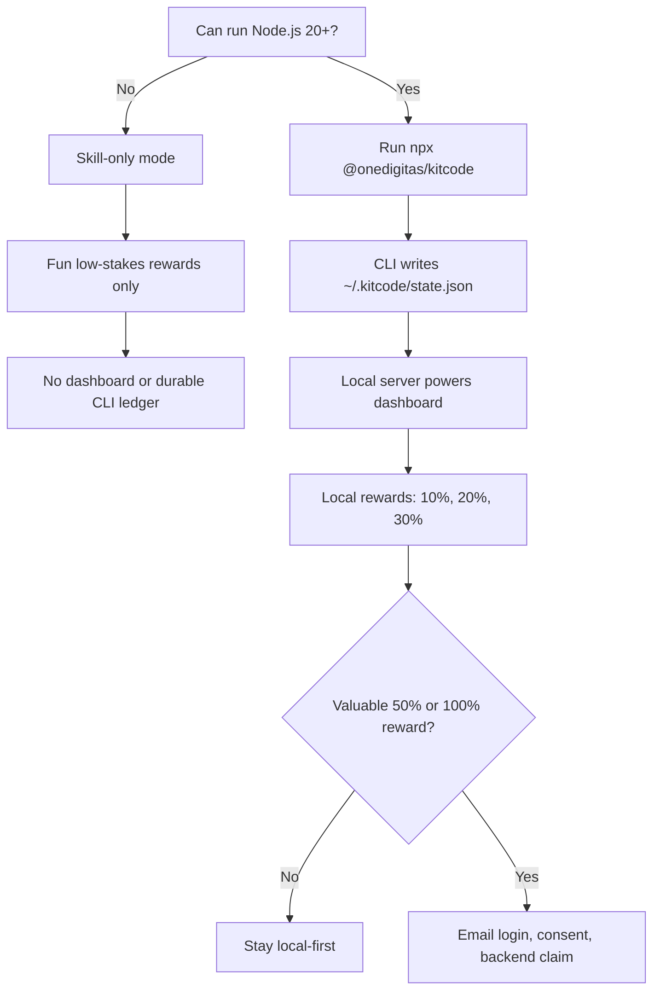

# kitcode

Run a local KitCode companion server for your machine.

```bash
npx @onedigitas/kitcode
```

The default command turns KitCode on for the current folder, detects Git Mode or Vibe Mode, and starts or reuses the local server on `127.0.0.1:4747`.

## What This Package Owns

The CLI/package is the source of truth for:

- tracking
- reward eligibility
- redeem state
- hook output
- local dashboard data

Skills and hooks should only surface CLI context. They should not calculate rewards, mutate the ledger, or decide voucher eligibility themselves.

## Rewards

| Tier | Code | Status |
| ---: | --- | --- |
| `10%` | `if(tired){return 10;}` | Local reward tier |
| `20%` | `takeBreak(20);` | Local reward tier |
| `30%` | `while(working)break(30);` | Local reward tier |
| `50%` | `mediumStake.unlock(50);` | Display-only unless backed by campaign flow |
| `100%` | `finalBreak.claim(100);` | Display-only unless backed by campaign flow |

For valuable `50%` or `100%` rewards, use backend login, consent, and a server-side claim record.

## Architecture



Recommended model: CLI owns local progress. Skills only nudge. A campaign backend only enters the flow for valuable rewards.

## Privacy

Local progress lives in `~/.kitcode/state.json`.

The local API returns aggregate values only:

- active and idle time
- active folder count
- commit count
- change batch count
- total equal (`=`) count
- reward progress

The server does not expose source code, raw diffs, full repo paths, project names, project ids, commit metadata, or arbitrary file-read endpoints.

## Commands

```bash
kitcode serve
kitcode add .
kitcode list
kitcode remove .
kitcode reward
kitcode redeem
kitcode redeem --tier 10
kitcode codex on
kitcode codex status
kitcode codex off
kitcode claude on
kitcode claude status
kitcode claude off
kitcode stop
kitcode start
```

<details>
<summary><strong>API</strong></summary>

```txt
GET /api/health
GET /api/summary
GET /api/projects
GET /api/events
POST /api/reward/redeem
```

Project-level mutation and commit-detail endpoints return `410 Gone`.

To allow another hosted dashboard origin:

```bash
KITCODE_ALLOWED_ORIGINS=https://your-kitcode-web.example npx @onedigitas/kitcode serve
```

</details>

## Requirements

- Node.js 20+
- Git for Git Mode

<details>
<summary><strong>Publishing</strong></summary>

From the repository root, bump the package version:

```bash
npm version patch -w @onedigitas/kitcode --no-git-tag-version
```

Then update the `VERSION` constant in `packages/kitcode-cli/bin/kitcode.mjs` to match `packages/kitcode-cli/package.json`.

Verify and publish:

```bash
npm run lint
npm run pack:cli
npm run publish:cli
```

</details>
