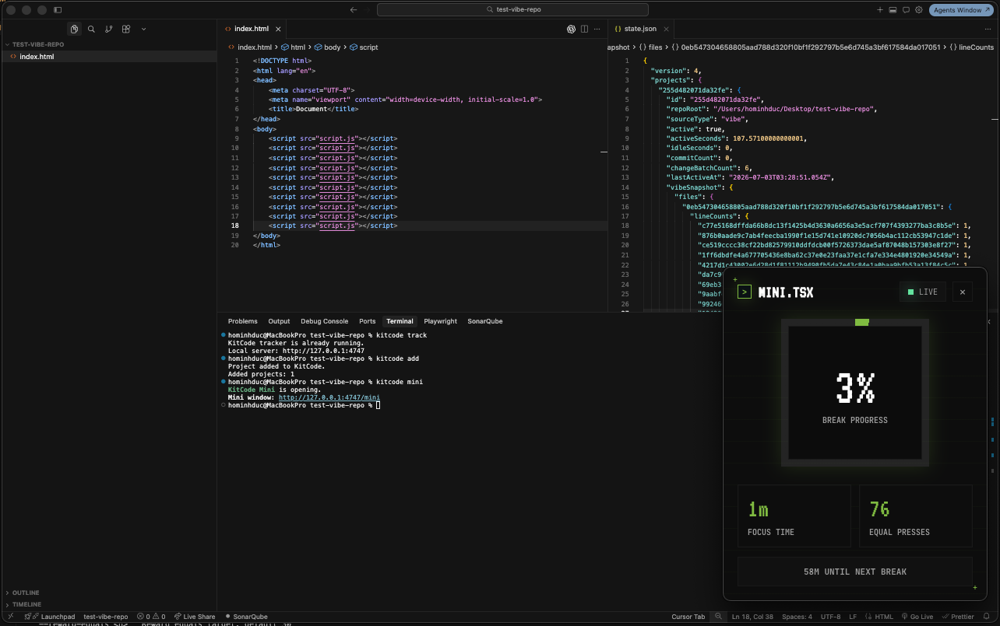
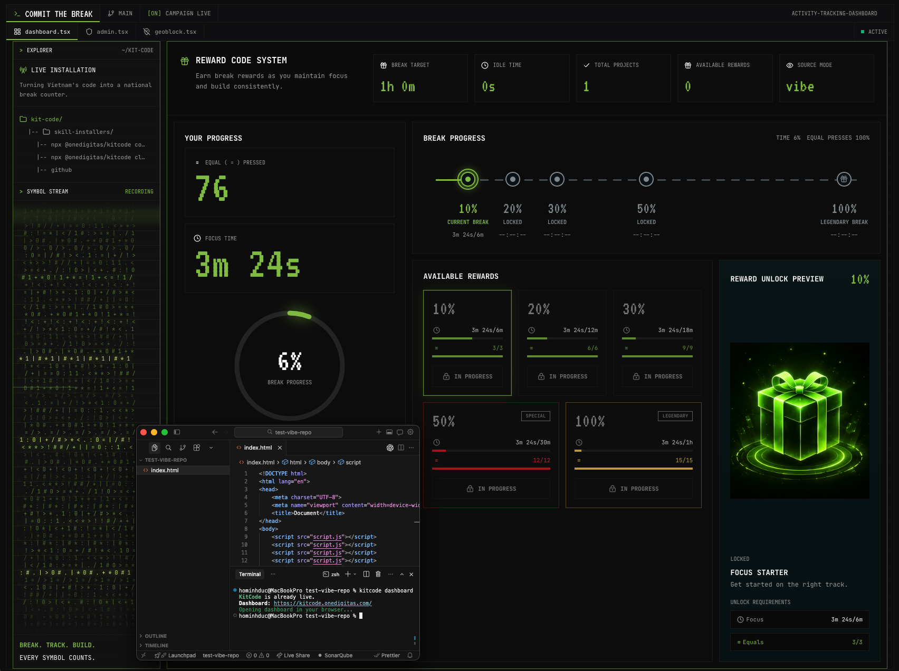

# kitcode

KitCode is a local break companion for coding campaigns. It tracks focused activity on your machine, serves local progress data, and opens a mini window or dashboard so users can see their break progress.

## Install And Run

Run from a project folder. Use the command on the left, then look for the screen on the right.

<table>
  <tr>
    <th>Command</th>
    <th>What it opens or enables</th>
  </tr>
  <tr>
    <td>
      <pre><code>npx @onedigitas/kitcode add .
npx @onedigitas/kitcode track
npx @onedigitas/kitcode mini</code></pre>
    </td>
    <td>
      <!-- TODO: Replace with final mini window image if needed -->
      
      <br />
      Mini window: a small progress view for day-to-day coding.
    </td>
  </tr>
  <tr>
    <td>
      <pre><code>npx @onedigitas/kitcode dashboard</code></pre>
    </td>
    <td>
      <!-- TODO: Replace with final dashboard image if needed -->
      
      <br />
      Dashboard: progress, milestones, and reward status.
    </td>
  </tr>
</table>

The tracker serves local data at:

```txt
http://127.0.0.1:4747
```

`track` can run before projects are added. It will wait in the background and pick up projects after `add`.

## Commands

| Command | What it does |
| --- | --- |
| `kitcode add [path]` | Add a project to KitCode. Defaults to the current folder. |
| `kitcode remove [path]` | Remove a project and its local contribution data. |
| `kitcode track` | Start the background tracker. |
| `kitcode untrack` | Stop the background tracker. Added projects remain registered. |
| `kitcode list` | Show added project totals. |
| `kitcode mini` | Open the mini window for the running tracker. |
| `kitcode dashboard` | Open the dashboard for the running tracker. |
| `kitcode codex on/off/status` | Manage the Codex hook and skill. |
| `kitcode claude on/off/status` | Manage the Claude hook and skill. |

Useful options:

```bash
kitcode track --port 4757
kitcode track --reward-seconds 3600
kitcode track --reward-equals 30
```

## Git Mode And Vibe Mode

KitCode chooses a mode automatically.

| Mode | When it happens | What it tracks |
| --- | --- | --- |
| Git Mode | The folder is inside a Git repository. | Commit count, focus time, and source-change batches. |
| Vibe Mode | The folder is not inside a Git repository. | Focus time and source-change batches. |

Both modes count `=` the same way:

- `kitcode add` creates a baseline snapshot.
- Existing code is baseline only.
- New code lines after the baseline can add counted `=`.
- Git commit count is still shown, but reward progress does not depend on a branch, merge, or deployment flow.

## What This Package Owns

The CLI/package is the source of truth for:

- local tracking
- local reward eligibility
- claim state
- hook output
- local dashboard data

Skills and hooks should only surface CLI context. They should not calculate rewards, mutate the ledger, or decide voucher eligibility themselves.

## Rewards

| Tier | Code | Status |
| ---: | --- | --- |
| `10%` | `if(tired){return 10;}` | Local reward tier |
| `20%` | `takeBreak(20);` | Local reward tier |
| `30%` | `while(working)break(30);` | Local reward tier |
| `50%` | `mediumStake.unlock(50);` | Display-only unless backed by campaign flow |
| `100%` | `finalBreak.claim(100);` | Display-only unless backed by campaign flow |

For valuable `50%` or `100%` rewards, use backend login, consent, and a server-side claim record.

## Privacy

Local progress lives in:

```txt
~/.kitcode/state.json
```

The local API returns aggregate values only:

- active and idle time
- added project count
- commit count
- change batch count
- total counted `=`
- break progress

The server does not expose source code, raw diffs, full repo paths, project names, project ids, commit metadata, or arbitrary file-read endpoints.

## API

```txt
GET /api/health
GET /api/summary
GET /api/projects
GET /api/events
POST /api/reward/redeem
```

Project-level mutation and commit-detail endpoints return `410 Gone`.

To allow another hosted dashboard origin:

```bash
KITCODE_ALLOWED_ORIGINS=https://your-kitcode-web.example npx @onedigitas/kitcode track
```

## Requirements

- Node.js 20+
- Git is optional, but enables Git Mode for repositories

## Publishing

From the repository root, bump the package version:

```bash
npm version patch -w @onedigitas/kitcode --no-git-tag-version
```

Then update the `VERSION` constant in `packages/kitcode-cli/bin/kitcode.mjs` to match `packages/kitcode-cli/package.json`.

Verify and publish:

```bash
npm run lint
npm run pack:cli
npm run publish:cli
```
